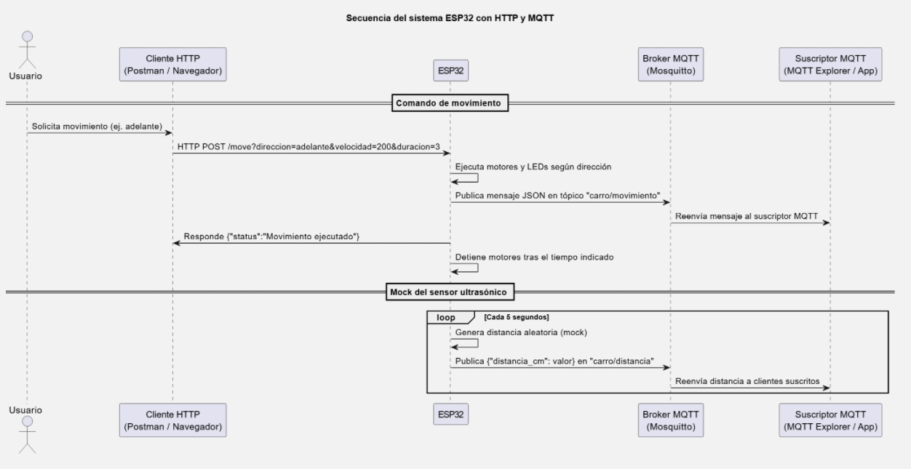
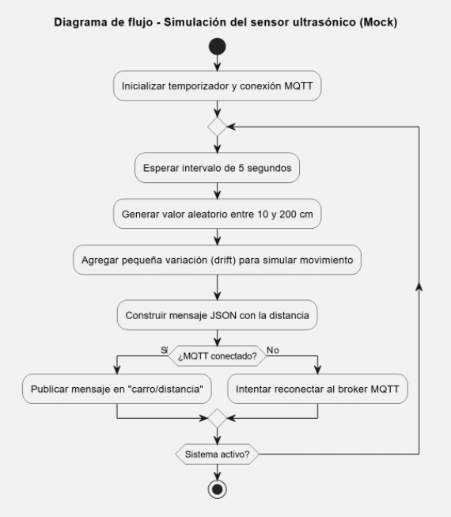

# Control y Simulación de Sensor Ultrasonido con ESP32 + MQTT

Este proyecto implementa un sistema IoT con ESP32 capaz de controlar el movimiento de un vehículo mediante HTTP y MQTT, además de simular lecturas de un sensor ultrasónico (HC-SR04) que se publican periódicamente a un tópico MQTT distinto.

El sistema combina comunicación en red, procesamiento local, simulación de sensores y publicación en la nube, manteniendo buenas prácticas de modularización con archivos `.h` para configuraciones y variables de preprocesador.

---

## Abstract

En este proyecto se diseña e implementa una arquitectura IoT para un carro controlado por ESP32.  
El sistema:
- Acepta comandos HTTP para moverse en distintas direcciones (adelante, atrás, izquierda, derecha).  
- Publica cada acción en un tópico MQTT de control.  
- Simula lecturas de distancia mediante un mock del sensor ultrasónico HC-SR04, que genera valores aleatorios realistas y los envía a un tópico MQTT distinto cada cierto tiempo.  

La implementación se desarrolló bajo principios de ingeniería modular, empleando un archivo `config.h` para definir variables de preprocesador y facilitar mantenimiento y portabilidad.

**Palabras clave:** IoT, ESP32, MQTT, HC-SR04, Arduino, Simulación, Ingeniería IEEE.

---

## Requisitos del sistema

- Microcontrolador: ESP32  
- Entorno: Arduino IDE o PlatformIO  
- Librerías necesarias:  
  - WiFi.h  
  - WebServer.h  
  - PubSubClient.h  
- Broker MQTT: Mosquitto (o test.mosquitto.org para pruebas)  
- Cliente de pruebas: Postman o MQTT Explorer  
- Conexión serial: 115200 bps  

---

## Funcionalidades principales

- Control remoto de movimiento vía HTTP  
- Publicación de eventos de movimiento en MQTT (`carro/movimiento`)  
- Simulación (mock) del sensor ultrasónico HC-SR04  
- Publicación periódica de la distancia simulada en MQTT (`carro/distancia`)  
- Uso de variables de preprocesador centralizadas en `config.h`  
- Reconexión WiFi y MQTT con retardo exponencial y jitter  
- Código modular, documentado y escalable  

---

## Arquitectura general

**[Espacio para diagrama de arquitectura del sistema (bloques ESP32 - MQTT - Cliente)]**

---

## Descripción técnica

El proyecto consta de dos archivos principales:

### 1. `main.ino`
Contiene la lógica de conexión WiFi, endpoints HTTP, control de motores, simulación del sensor y publicación periódica a MQTT.

### 2. `config.h`
Define las variables de preprocesador que configuran:
- Pines del ESP32 (motores, LEDs, sensor)
- Credenciales WiFi
- Configuración MQTT (broker, tópicos, ID de cliente)

**[Espacio para captura del código o estructura de carpetas del repositorio]**

---

## Endpoints HTTP implementados

| Método | URL | Descripción | Parámetros | Ejemplo |
|--------|-----|--------------|-------------|----------|
| GET | `/status` | Verifica el estado del servidor | — | `{ "status":"Servidor operativo" }` |
| POST | `/move` | Envía comando de movimiento | `direccion`, `velocidad`, `duracion` | `http://<ip>/move?direccion=adelante&velocidad=200&duracion=3` |

**[Espacio para captura Postman (endpoint /move)]**

---

## Tópicos MQTT

| Tópico | Descripción | Ejemplo JSON publicado |
|--------|--------------|-------------------------|
| `carro/movimiento` | Envía los datos del movimiento ejecutado | `{ "cliente":"192.168.1.12", "direccion":"adelante", "velocidad":200, "duracion":3 }` |
| `carro/distancia` | Publica la distancia simulada del sensor mock | `{ "distancia_cm":145.32 }` |

**[Espacio para captura MQTT Explorer con ambos tópicos]**

---

## Pruebas realizadas

**[Captura 1: Serial Monitor mostrando conexión WiFi y MQTT]**  
**[Captura 2: Postman ejecutando /move]**  
**[Captura 3: Mensajes MQTT en carro/movimiento y carro/distancia]**  
**[Captura 4: Simulación de lecturas del sensor mock cada 5 segundos]**

---

## Instrucciones de uso

1. Configurar credenciales WiFi y el broker MQTT en `config.h`.  
2. Cargar el código al ESP32 mediante Arduino IDE.  
3. Conectar el ESP32 y abrir el Monitor Serial (115200 bps).  
4. Verificar la conexión WiFi y la dirección IP asignada.  
5. Probar los endpoints HTTP (`/status`, `/move`).  
6. Abrir el cliente MQTT y suscribirse a:  
   - `carro/movimiento`  
   - `carro/distancia`  
7. Observar la publicación automática del mock ultrasónico cada 5 segundos.  

---

## Diagramas del sistema

### **Diagrama de secuencia UML**  

### **Diagrama de flujo**

---

## Referencias

[1] Espressif Systems – ESP32 Wi-Fi Programming Guide, 2023.  
[2] Arduino – PubSubClient & WebServer Libraries Documentation, 2024.  
[3] IEEE – Standards for IoT System Documentation, 2020.  

---

## Autores

**Juan David Henao Osorio** – Universidad de La Sabana  
**Santiago Bazzani Rincón** – Universidad de La Sabana

