# Control y Simulación de Sensor Ultrasonido con ESP32 + MQTT

El presente documento describe el desarrollo, implementación y análisis técnico del proyecto de vehículo IoT de dos ruedas (2WD) controlado mediante un microcontrolador ESP32, que integra tecnologías de comunicación segura, visualización de datos en tiempo real y control remoto desde una interfaz web.

El sistema fue diseñado con el propósito de demostrar la integración entre hardware, software y protocolos de comunicación IoT, aplicando buenas prácticas de seguridad, eficiencia energética y modularidad de código.

El prototipo se apoya en el uso de protocolos REST y MQTT cifrados con TLS, junto con una interfaz gráfica basada en tecnologías web modernas como HTML5, CSS3, JavaScript, p5.js y MQTT.js.  
Este documento presenta la estructura del sistema, los endpoints, los tópicos utilizados, las librerías, el análisis de memoria y los resultados de pruebas funcionales y de seguridad.

---

## Abstract

En este proyecto se diseña e implementa una arquitectura IoT para un carro controlado por ESP32.  
El sistema:
- Acepta comandos HTTP para moverse en distintas direcciones (adelante, atrás, izquierda, derecha).  
- Publica cada acción en un tópico MQTT de control.  
- Simula lecturas de distancia mediante un mock del sensor ultrasónico HC-SR04, que genera valores aleatorios realistas y los envía a un tópico MQTT distinto cada cierto tiempo.  

La implementación se desarrolló bajo principios de ingeniería modular, empleando un archivo `config.h` para definir variables de preprocesador y facilitar mantenimiento y portabilidad.

**Palabras clave:** IoT, ESP32, MQTT, HC-SR04, Arduino, Simulación, Ingeniería IEEE.

---

## Objetivos Generales y Específicos

**Objetivo general:**  
Diseñar y construir un robot móvil controlado remotamente que utilice comunicación MQTT cifrada y permita la detección y visualización de obstáculos a través de una interfaz web en tiempo real.

**Objetivos específicos:**
- Implementar un sistema de detección de obstáculos utilizando un sensor ultrasónico HC-SR04.  
- Desarrollar una API RESTful en el ESP32 para permitir el control de movimiento del robot mediante peticiones HTTP.  
- Establecer una comunicación segura con el servidor MQTT utilizando TLS 1.2 (WSS).  
- Implementar un panel web interactivo con radar visual y control de movimiento mediante teclado o botones.  
- Documentar la arquitectura del sistema, los endpoints, los tópicos MQTT, el uso de memoria, las pruebas realizadas y las oportunidades de mejora.  

## Requisitos del sistema

- Microcontrolador: ESP32  
- Entorno: Arduino IDE o PlatformIO  
- Librerías necesarias:  
  - WiFi.h  
  - WebServer.h  
  - PubSubClient.h  
- Broker MQTT: Mosquitto (o test.mosquitto.org para pruebas)  
- Cliente de pruebas: Postman o MQTT Explorer  
- Conexión serial: 115200 bps  

---

## Funcionalidades principales

- Control remoto de movimiento vía HTTP  
- Publicación de eventos de movimiento en MQTT (`carro/movimiento`)  
- Simulación (mock) del sensor ultrasónico HC-SR04  
- Publicación periódica de la distancia simulada en MQTT (`carro/distancia`)  
- Uso de variables de preprocesador centralizadas en `config.h`  
- Reconexión WiFi y MQTT con retardo exponencial y jitter  
- Código modular, documentado y escalable  

---

## Arquitectura General del Sistema

La arquitectura del proyecto se compone de tres capas principales:

1. **Capa Física:**  
   Incluye el ESP32, el puente H L298N, los motores DC, el sensor ultrasónico HC-SR04 y el servo motor encargado de rotar el sensor para formar el radar.

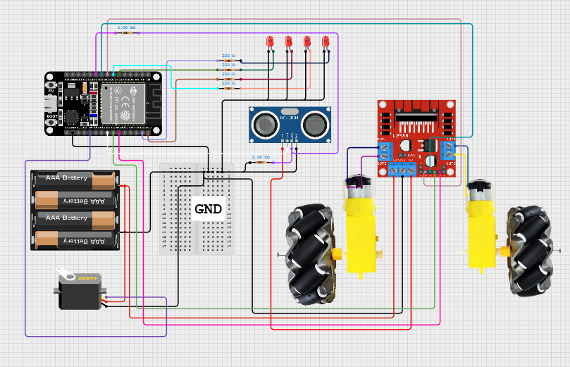
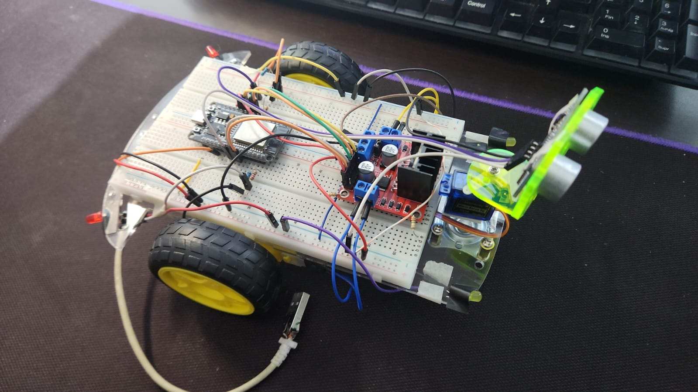

3. **Capa de Comunicación:**  
   Basada en HTTP (API REST) para los comandos de movimiento y MQTT con cifrado TLS para la transmisión de datos de sensores en tiempo real hacia la interfaz web.

4. **Capa de Visualización y Control:**  
   Desarrollada en HTML, CSS, p5.js y MQTT.js, muestra la distancia detectada, el radar en tiempo real y permite el control remoto del vehículo.

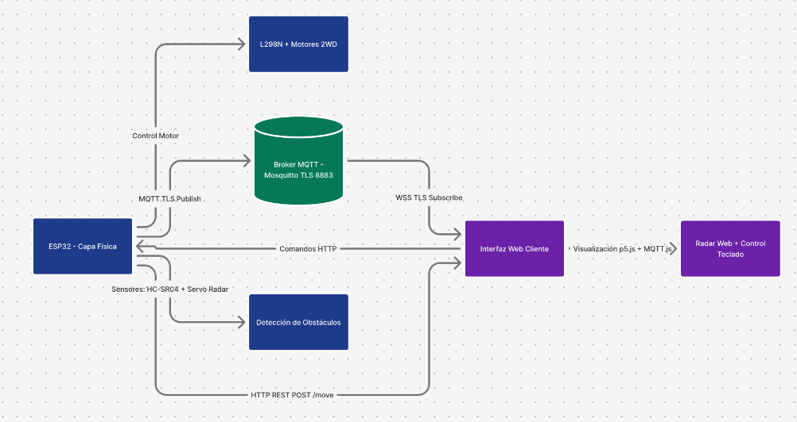

### Diagrama de Arquitectura del Sistema

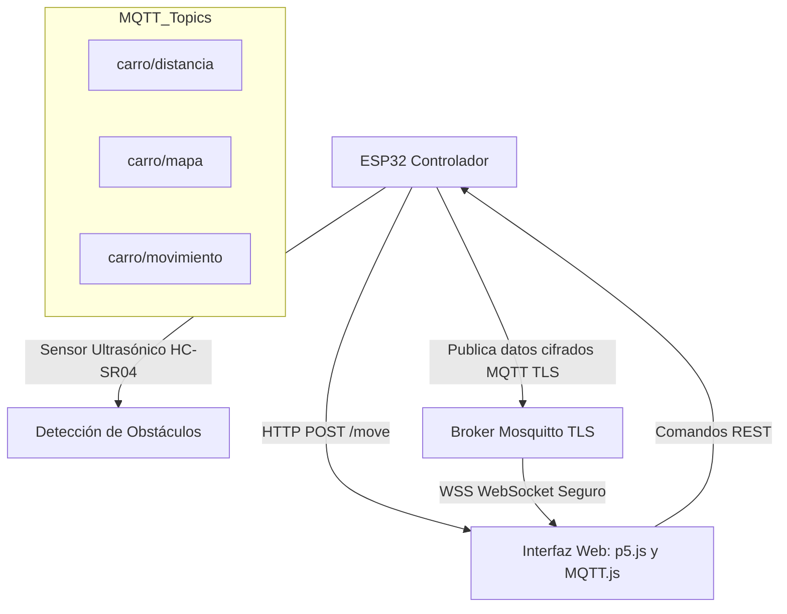
```mermaid
graph TD
    A[ESP32 Controlador] -->|HTTP POST /move| B[Interfaz Web: p5.js y MQTT.js]
    B -->|Comandos REST| A
    A -->|Sensor Ultrasónico HC-SR04| C[Detección de Obstáculos]
    A -->|Publica datos cifrados MQTT TLS| D[Broker Mosquitto TLS]
    D -->|WSS WebSocket Seguro| B
    subgraph MQTT_Topics
        T1["carro/distancia"]
        T2["carro/mapa"]
        T3["carro/movimiento"]
    end
```

---

## Descripción Técnica

El sistema está controlado por un ESP32 DevKit v1, programado en lenguaje C++ mediante el entorno Arduino IDE 2.3.2.  
El ESP32 cumple tres funciones simultáneas:
1. Servidor web local para servir la interfaz y los endpoints REST.  
2. Cliente MQTT seguro para enviar y recibir datos con cifrado TLS.  
3. Controlador físico de los motores, sensor ultrasónico y servo motor.

El sensor HC-SR04 se encarga de detectar obstáculos midiendo la distancia mediante el tiempo de retorno de una onda ultrasónica.  
Los datos recolectados se publican de manera continua en los tópicos MQTT `carro/distancia` y `carro/mapa`.  
La interfaz web interpreta estas lecturas y las representa visualmente en un radar que muestra objetos cercanos en color rojo y zonas despejadas en verde.


**Usando MicroPython**


**Usando C++ Arduino IDE**

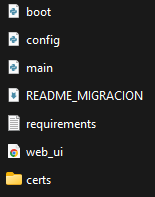

---

## API REST: Endpoints Implementados

| Método | Endpoint | Descripción | Ejemplo de Uso | Respuesta Esperada |
|--------|-----------|--------------|----------------|--------------------|
| `GET` | `/api/v1/healthcheck` | Comprueba el estado operativo del servidor. | `/api/v1/healthcheck` | `{ "status": "ok", "uptime": 42 }` |
| `POST` | `/api/v1/move?dir=forward&speed=200` | Envía orden de movimiento. | `/api/v1/move?dir=forward` | `{ "dir": "forward", "speed": 200 }` |
| `GET` | `/api/v1/move` | Consulta el estado actual del movimiento. | `/api/v1/move` | `{ "dir": "stop" }` |
| GET | `/status` | Verifica el estado del servidor | — | `{ "status":"Servidor operativo" }` |
| POST | `/move` | Envía comando de movimiento | `direccion`, `velocidad`, `duracion` | `http://<ip>/move?direccion=adelante&velocidad=200&duracion=3` |

**Colección Postman:** `MQTT-Robot.postman_collection.json`  
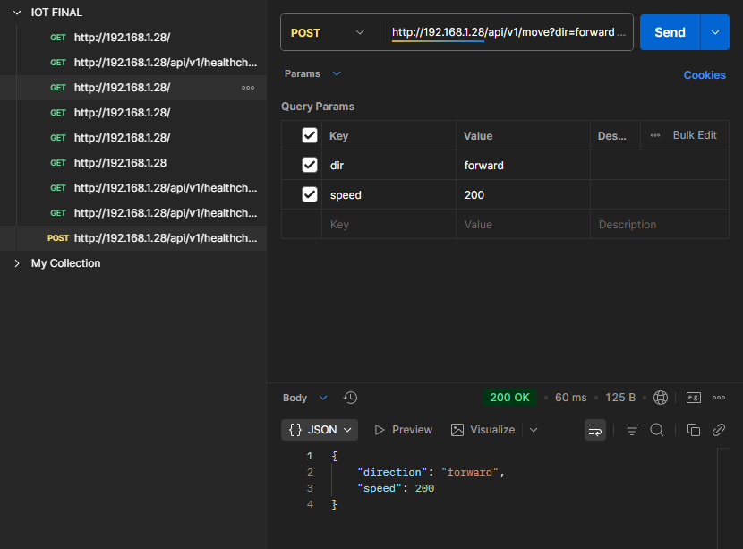
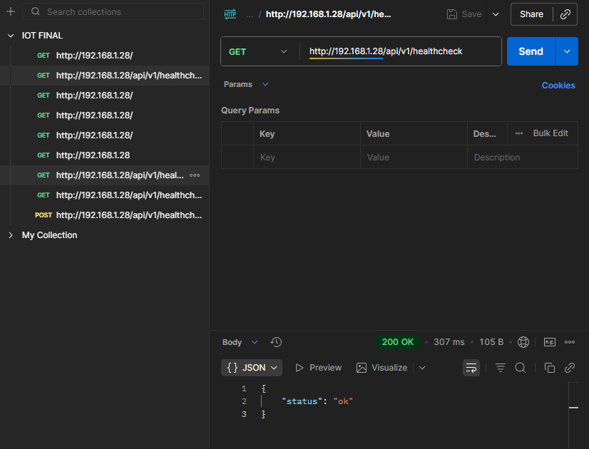

---

## Tópicos MQTT con Comunicación Segura

| Tópico | Dirección | Descripción | Ejemplo JSON |
|--------|------------|--------------|---------------|
| `carro/distancia` | Publicación | Muestra la distancia medida por el sensor ultrasónico. | `{ "distance_cm": 112.6 }` |
| `carro/mapa` | Publicación | Datos de ángulo y distancia usados por el radar web. | `{ "angle_deg": 75, "distance_cm": 45.7 }` |
| `carro/movimiento` | Publicación | Estado actual del movimiento del vehículo. | `{ "dir": "left", "speed": 200 }` |
| `carro/comando` | Suscripción | (Futuro) recepción de comandos externos por MQTT. | `{ "action": "stop" }` |

Protocolo: MQTT sobre TLS  
Broker: `test.mosquitto.org`  
Puerto: `8883`  
Certificado raíz: ISRG Root X1 (Let's Encrypt)  
En la interfaz web: comunicación mediante `WSS://test.mosquitto.org:8081/mqtt`


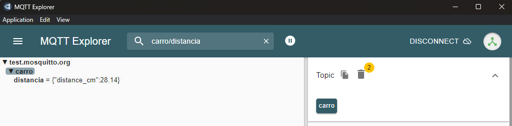
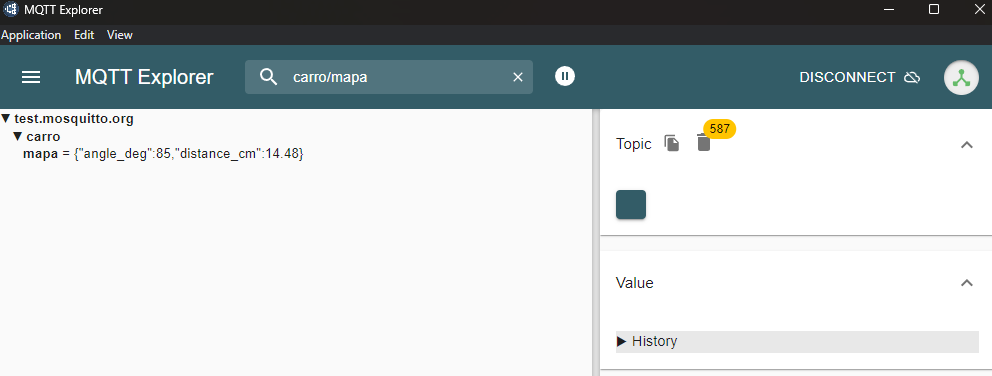

---

---

## Comunicación Segura (TLS/WSS)

Toda la comunicación entre el ESP32 y el broker MQTT está cifrada utilizando el protocolo TLS 1.2, con el objetivo de garantizar:

- Confidencialidad: protección de los datos transmitidos entre el dispositivo y el servidor.  
- Integridad: prevención de alteraciones o manipulaciones de los mensajes.  
- Autenticidad: validación del certificado raíz del servidor broker.

Ejemplo del código de inicialización segura:

```cpp
WiFiClientSecure secureClient;
secureClient.setCACert(MQTT_MOSQ_CA);
PubSubClient mqttClient(secureClient);
mqttClient.setServer("test.mosquitto.org", 8883);
```

---

## Flujo de Datos del Sistema

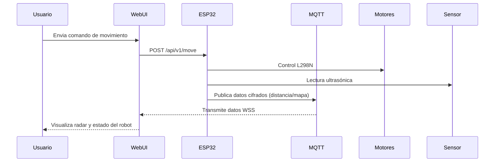
```mermaid
sequenceDiagram
    participant Usuario
    participant WebUI
    participant ESP32
    participant MQTT
    Usuario->>WebUI: Envia comando de movimiento
    WebUI->>ESP32: POST /api/v1/move
    ESP32->>Motores: Control L298N
    ESP32->>Sensor: Lectura ultrasónica
    ESP32->>MQTT: Publica datos cifrados (distancia/mapa)
    MQTT-->>WebUI: Transmite datos WSS
    WebUI-->>Usuario: Visualiza radar y estado del robot
```

---

## Análisis del Uso de Memoria

Durante la compilación, el entorno Arduino IDE reportó el siguiente uso de memoria:

| Recurso | Uso | Descripción |
|----------|-----|-------------|
| Flash | 61% (≈ 850 KB / 1.3 MB) | Código fuente y certificados TLS |
| RAM | 54% (≈ 171 KB / 320 KB) | MQTT, buffers de red y radar |
| Heap Libre | ~147 KB | Suficiente para operación continua |
| Consumo TLS | +17% adicional | Sobrecarga por encriptación y claves SSL |

[Subir imagen aquí: captura del log de compilación con el reporte de memoria]

---

## Librerías y Dependencias

| Librería | Descripción Técnica |
|-----------|--------------------|
| WiFi.h | Conexión del ESP32 a redes inalámbricas. |
| WebServer.h | Implementación del servidor HTTP local. |
| WiFiClientSecure.h | Soporte para cifrado TLS/SSL. |
| PubSubClient.h | Cliente MQTT compatible con Mosquitto. |
| ArduinoJson.h | Serialización de estructuras de datos JSON. |
| ESP32Servo.h | Control preciso del servo radar. |
| p5.js / MQTT.js | Gráficos interactivos y conexión WebSocket. |

---

## Pruebas Realizadas

### Prueba 1: Conexión WiFi y API `/healthcheck`
**Procedimiento:** conectar el ESP32 a una red local e ingresar desde el navegador a la ruta `/api/v1/healthcheck`.  
**Resultado esperado:** respuesta JSON con estado "ok" y tiempo de actividad.  
**Estado:** Éxito  

Serial Monitor mostrando conexión WiFi y MQTT
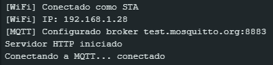

### Prueba 2: Envío de Comandos HTTP
**Procedimiento:** enviar comandos `forward`, `left`, `stop` desde la interfaz web y verificar respuesta del servidor.  
**Resultado esperado:** el vehículo responde con movimiento y respuesta HTTP 200 OK.  
**Estado:** Éxito  
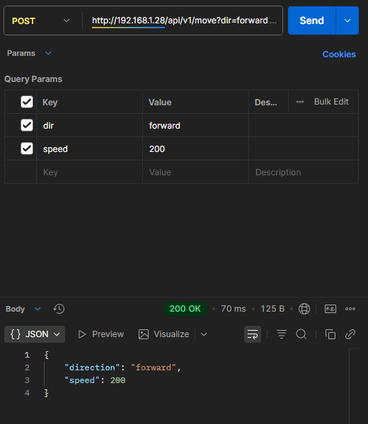

---

### Prueba 3: Comunicación MQTT TLS
**Procedimiento:** suscribirse a `carro/distancia` y `carro/mapa` desde MQTT Explorer con puerto 8883 (TLS).  
**Resultado esperado:** recepción periódica de datos JSON con distancia y ángulo.  
**Estado:** Éxito  


---

### Prueba 4: Radar Web y Representación Gráfica
**Procedimiento:** abrir la interfaz web y visualizar los objetos detectados en el radar.  
**Resultado esperado:** zonas verdes (libres) y rojas (obstáculos).  
**Estado:** Éxito 
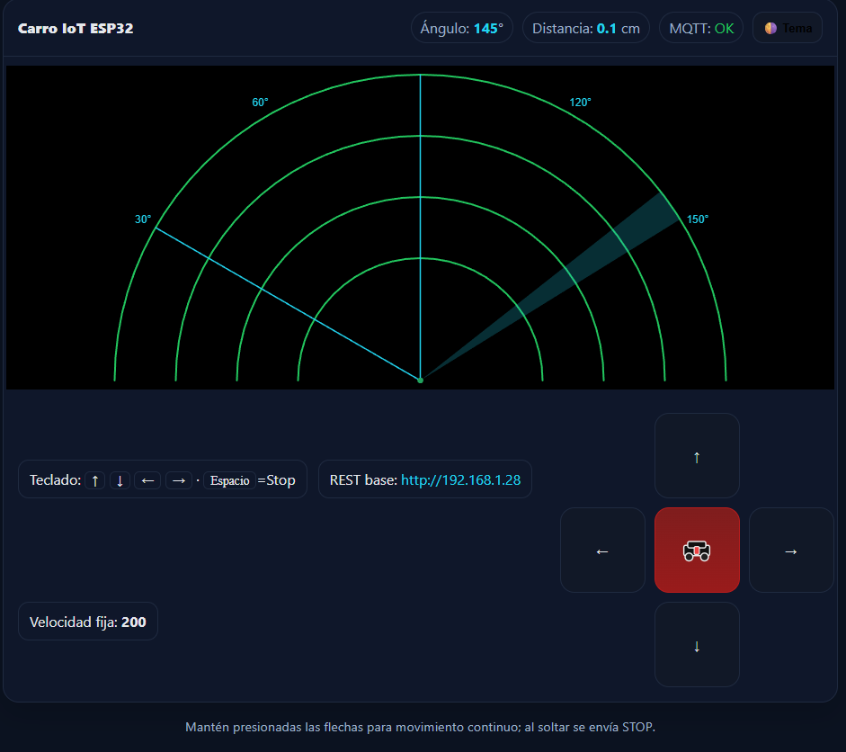

---

## Instrucciones de uso

1. Configurar credenciales WiFi y el broker MQTT en `config.h`.  
2. Cargar el código al ESP32 mediante Arduino IDE.  
3. Conectar el ESP32 y abrir el Monitor Serial (115200 bps).  
4. Verificar la conexión WiFi y la dirección IP asignada.  
5. Probar los endpoints HTTP (`/status`, `/move`).  
6. Abrir el cliente MQTT y suscribirse a:  
   - `carro/movimiento`  
   - `carro/distancia`  
7. Observar la publicación automática del mock ultrasónico cada 5 segundos.  

---

## Diagramas del sistema

### **Diagrama de secuencia UML**  
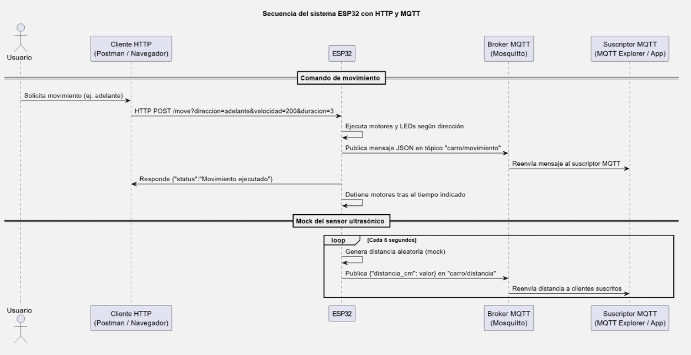


### **Diagrama de flujo**
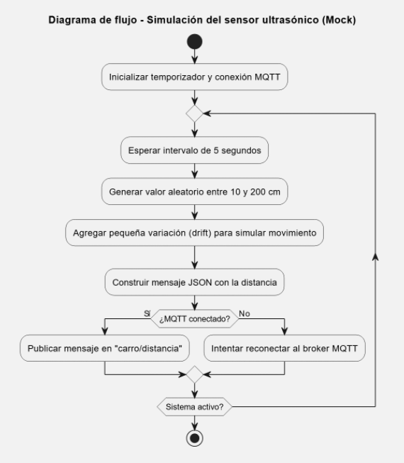

---

# Pruebas de Conexión MQTT con TLS en ESP32

Este documento describe las pruebas realizadas para conectar un ESP32 a
un broker MQTT utilizando diferentes configuraciones de seguridad
(puerto inseguro, TLS sin validación, TLS con validación y TLS con
certificado CA).

Incluye código, evidencias de monitor serial y conclusiones de seguridad
para cada escenario.

------------------------------------------------------------------------

## Preparación del Entorno

### Modificaciones necesarias en `config.h`

``` cpp
// Puerto seguro MQTT
#define MQTT_PORT_SECURE 8883
#define MQTT_PORT_INSECURE 1883
```

------------------------------------------------------------------------

#  Pruebas de Código

------------------------------------------------------------------------

##  Prueba 1 --- Conexión al puerto seguro **sin TLS**

**Objetivo:** Cambiar solo el puerto a `8883` sin usar TLS, para
verificar qué ocurre.

### Fragmento de código

``` cpp
// PRUEBA 1: Cambiar solo el puerto a 8883
// Resultado esperado: FALLO - El broker requiere TLS

void setup() {
  Serial.begin(115200);
  pinMode(IN1_PIN, OUTPUT);
  pinMode(IN2_PIN, OUTPUT);
  pinMode(IN3_PIN, OUTPUT);
}
```

###  Evidencia - Monitor Serial

    WiFi conectado
    IP: 192.168.1.100
    Intentando conectar a puerto seguro sin TLS...
    Error: No se puede conectar al broker MQTT
    Reintentando conexión MQTT...
    [Bucle infinito de reintentos]

###  Conclusión

 **FALLA.** El puerto `8883` exige TLS, pero se está usando
`WiFiClient`, que no soporta cifrado.

------------------------------------------------------------------------

##  Prueba 2 --- TLS sin validación de certificado (`setInsecure()`)

**Objetivo:** Usar `WiFiClientSecure` sin validar certificados.

### Código simplificado

``` cpp
#include <WiFi.h>
#include <WebServer.h>
#include <PubSubClient.h>
#include <WiFiClientSecure.h>
#include "config.h"

WiFiClientSecure espClient;   // Cliente TLS sin validación
```

###  Evidencia - Monitor Serial

    === PRUEBA 2: TLS SIN VALIDACIÓN DE CERTIFICADO ===
    ⚠️ Validación de certificados DESHABILITADA
    Intentando conexión MQTT TLS (sin validación)... ✓ Conectado!
    Distancia publicada vía TLS: 145.67 cm
    Distancia publicada vía TLS: 78.23 cm

###  Conclusión

✔ **FUNCIONA**, pero:

 **Vulnerable a ataques Man-in-the-Middle (MitM)**\
Los datos viajan cifrados pero no se verifica el servidor.

------------------------------------------------------------------------

##  Prueba 3 --- TLS con validación, **pero sin cargar certificado CA**

**Objetivo:** Activar validación de certificado sin proporcionar CA →
debe fallar.

### Código simplificado

``` cpp
WiFiClientSecure espClient;
PubSubClient client(espClient);
```

###  Evidencia - Monitor Serial

    === PRUEBA 3: TLS CON VALIDACIÓN (SIN CERTIFICADO) ===
    ✓ Validación habilitada
    ✗ Certificado CA NO proporcionado

    Intento 1... rc=-2 TLS Error: -1
    → No se pudo verificar el certificado del servidor
    Reintentando...

    Intento 2... rc=-2 TLS Error: -1
    Reintentando...


#  Script para renovación de certificados

``` bash
#!/bin/bash
BROKER="test.mosquitto.org"
PORT="8883"
OUTPUT="mosquitto_ca.pem"

echo "Obteniendo certificado..."
openssl s_client -showcerts -connect $BROKER:$PORT < /dev/null   | openssl x509 -outform PEM > $OUTPUT

echo "Certificado guardado en $OUTPUT"
```

## Limitaciones Detectadas

- Dependencia directa de la estabilidad de la conexión WiFi.  
- Incremento de consumo de RAM por la carga del certificado TLS.  
- Sin autenticación en la API REST (solo red local).  
- El radar requiere calibración manual del servo en cada reinicio.  
- Latencia promedio de 200–300 ms en la transmisión de datos MQTT.

---

## Oportunidades de Mejora

1. Autenticación bidireccional (mTLS) para reforzar la seguridad en MQTT.  
2. Implementar control de velocidad PWM dinámico según distancia al obstáculo.  
3. Desarrollar una aplicación móvil multiplataforma.  
4. Integrar persistencia de datos (InfluxDB + Grafana) para análisis histórico.  
5. Añadir un módulo ESP32-CAM para streaming de video en tiempo real.  
6. Ampliar la detección con sensores IR o LIDAR.  
7. Optimizar el manejo de memoria y tareas concurrentes mediante FreeRTOS.

---

## Conclusiones Generales

El proyecto Carro IoT 2WD logra consolidar una arquitectura IoT completa con comunicación segura, eficiente y escalable, cumpliendo los objetivos académicos de diseño, implementación y validación de sistemas embebidos conectados.

La integración entre el hardware físico, la comunicación cifrada y la interfaz web representa un modelo funcional aplicable a entornos de automatización, robótica educativa y domótica inteligente.  
Desde la perspectiva de Ingeniería Informática, el sistema destaca por su:

- Aplicación práctica de los protocolos de red IoT (HTTP + MQTT + TLS).  
- Diseño modular con posibilidad de ampliación.  
- Adopción de principios de seguridad informática en la capa de comunicación.  
- Interfaz gráfica intuitiva y eficiente para control en tiempo real.  

Este proyecto demuestra la viabilidad técnica del uso de microcontroladores de bajo costo en entornos distribuidos de alta confiabilidad, aplicando conceptos fundamentales de computación embebida, redes seguras y sistemas ciberfísicos.

## Referencias

[1] Espressif Systems – ESP32 Wi-Fi Programming Guide, 2023.  
[2] Arduino – PubSubClient & WebServer Libraries Documentation, 2024.  
[3] IEEE – Standards for IoT System Documentation, 2020.  

---

## Autores

**Juan David Henao Osorio** – Universidad de La Sabana  
**Santiago Bazzani Rincón** – Universidad de La Sabana

